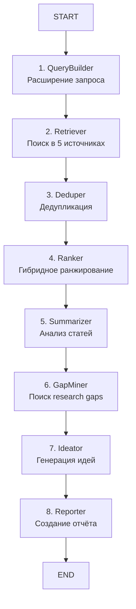

# 🏗️ Архитектура AI агента

## Обзор системы

Система представляет собой многокомпонентный AI-агент на базе LangGraph, выполняющий систематический поиск и анализ научной литературы.

```
┌─────────────────────────────────────────────────────────────────┐
│                    AI Research Agent (LangGraph)                │
├─────────────────────────────────────────────────────────────────┤
│  Input: Research Query + Time Window + Max Papers               │
│  Output: Structured Markdown Report with Citations              │
└─────────────────────────────────────────────────────────────────┘
```

---

## Pipeline Flow



---

## Детальная архитектура компонентов

### 1. QueryBuilder

**Функция:** `build_topic_card()`

**Вход:** `query` (str)

**Процесс:**
- LLM анализ запроса
- Извлечение ключевых терминов
- Генерация синонимов
- Создание расширенных запросов (3-5)

**Выход:** `TopicCard`
```python
{
    "must": ["term1", "term2"],
    "should": ["synonym1", "synonym2"],
    "must_not": ["exclude1"],
    "synonyms": ["syn1", "syn2"],
    "expanded_queries": ["query1", "query2", "query3"]
}
```

---

### 2. Multi-Source Retriever

**Функция:** `multi_source_retriever()`

**Параллельные запросы к 5 источникам:**

| Источник | Макс. результатов | Особенности |
|----------|-------------------|-------------|
| **OpenAlex** | 30 | Общие науки, open access |
| **Semantic Scholar** | 30 | AI/CS, citation metrics |
| **Crossref** | 30 | DOI, journal metadata |
| **ArXiv** | 30 | Preprints: CS, Math, Physics |
| **PubMed** | 30 | Biomedical |

**Выход:** `SeedResults` (150+ papers)

**API вызовы:** 5

---

### 3. Deduper/Normalizer

**Функция:** `deduplicate_and_normalize()`

**Процесс дедупликации:**
1. По DOI (если есть)
2. По ArXiv ID (если есть)
3. По PMID (если есть)
4. Fuzzy match по title (threshold=0.85)

**Нормализация:**
- Вычисление `citations_per_year`
- Вычисление `recency_score`
- Стандартизация метаданных

**Выход:** `CorpusIndex` (80-100 unique papers)

---

### 4. Hybrid Ranker

**Функция:** `hybrid_ranker()`

**Основной метод:** Semantic Search (Dense Embeddings)

**Формула ранжирования:**
```
score = 0.75 × semantic_score (dense embeddings)  [ОСНОВНОЙ]
      + 0.10 × recency_score                       [опционально]
      + 0.08 × normalized(citations_per_year)      [опционально]
      + 0.05 × log_normalized(citations_total)     [опционально]
      + 0.02 × venue_score                         [опционально]
```

**Настройка компонентов** (`config.py`):
```python
RANKING_COMPONENTS = {
    "semantic_search": True,    # ОСНОВНОЙ (рекомендуется)
    "recency": True,            # Опционально
    "citations_per_year": True, # Опционально
    "citations_total": True,    # Опционально
    "venue": True,              # Опционально
    "keywords_bm25": False,     # По умолчанию ВЫКЛЮЧЕНО
}
```

**Venue Scores:**
- Nature, Science, Cell: 1.0
- NeurIPS, ICML, ICLR: 0.90
- ACL, EMNLP: 0.85
- Unknown: 0.5

**Дополнительные функции (опционально):**
- LLM Rerank: переранжирование топ-20 через LLM
- Citation Snowballing: расширение через граф цитирований

**Выход:** `RankedPapers` (Top N, default=40)

---

### 5. Summarizer

**Функция:** `create_literature_matrix()`

**Процесс для каждой статьи (Top 10):**
- LLM извлечение structured summary
- Автоматический поиск GitHub репозиториев

**Structured Summary:**
```python
{
    "problem": "...",
    "methods": ["method1", "method2"],
    "datasets": ["dataset1", "dataset2"],
    "metrics": ["metric1", "metric2"],
    "key_findings": "...",
    "limitations": "...",
    "future_work": "...",
    "contributions": "...",
    "experimental_setup": "...",
    "reproducibility_info": "...",
    "discussion": "..."
}
```

**Выход:** `LitMatrix` (10 papers с structured summaries)

**API вызовы:** 10 (LLM) + опционально GitHub API

---

### 6. GapMiner

**Функция:** `find_research_gaps()`

**Многоуровневый анализ:**

1. **Temporal Evolution** — анализ временных трендов
2. **Contradiction Detection** — поиск противоречий
3. **Methodological Gaps** — недостающие методы
4. **Reproducibility Analysis** — проблемы воспроизводимости
5. **Scalability Analysis** — ограничения масштабируемости
6. **Cross-Domain Opportunities** — междисциплинарные возможности
7. **LLM Deep Analysis** — глубокий анализ через LLM

**Типы gaps (8):**
- `methodological` — недостающие методы
- `data` — недостающие датасеты/домены
- `metric` — недостающие метрики оценки
- `reproducibility` — проблемы воспроизводимости
- `contradiction` — противоречивые результаты
- `temporal` — устаревшие подходы
- `scalability` — ограничения масштабируемости
- `cross_domain` — междисциплинарные возможности

**Severity:** `high` | `medium` | `low`

**Структура gap:**
```python
{
    "type": "methodological",
    "severity": "high",
    "description": "...",
    "evidence": ["paper1", "paper2"],
    "reasoning": "...",
    "potential_impact": "...",
    "related_methods": ["method1"],
    "feasibility": "..."
}
```

**Выход:** `GapList` (3-10 gaps с evidence)

**API вызовы:** 1 (LLM)

---

### 7. Ideator

**Функция:** `generate_research_ideas()`

**Процесс:**
- LLM генерация гипотез (5 идей)
- Связь каждой идеи с выявленными gaps

**Структура идеи:**
```python
{
    "hypothesis": "...",
    "experiment_plan": {
        "methods": ["method1", "method2"],
        "datasets": ["dataset1", "dataset2"],
        "baselines": ["baseline1", "baseline2"],
        "metrics": ["metric1", "metric2"]
    },
    "expected_outcome": "...",
    "risks": ["risk1", "risk2"],
    "related_gap": "gap_id"
}
```

**Выход:** `IdeaBank` (5 testable hypotheses)

**API вызовы:** 1 (LLM)

---

### 8. Reporter

**Функция:** `generate_final_report()`

**Генерация Markdown отчёта:**

1. **Executive Summary** — краткая сводка
2. **Top-10 Papers** — с метаданными, DOI, URL
3. **Literature Matrix** — таблица с анализом
4. **Research Gaps** — с severity маркерами
5. **Research Ideas** — с планами экспериментов
6. **Metrics & Statistics** — статистика поиска
7. **Conclusion** — заключение

**Выход:** Markdown Report (файл: `research_report_*.md`)

---

## State Management

```python
class AgentState(TypedDict):
    # === Входные данные ===
    query: str               # Исследовательский запрос
    time_window: int         # Временное окно (лет)
    max_papers: int          # Максимум статей для анализа
    
    # === Артефакты pipeline ===
    topic_card: Dict         # QueryBuilder output
    seed_results: List       # Retriever output (150+)
    corpus_index: List       # Deduper output (80-100)
    ranked_papers: List      # Ranker output (40)
    lit_matrix: List         # Summarizer output (10)
    gap_list: List           # GapMiner output (3-10)
    idea_bank: List          # Ideator output (5)
    final_response: str      # Reporter output (Markdown)
    
    # === Метаданные ===
    messages: List           # История LLM
    budget: Dict             # Счётчики вызовов API
```

---

## API Интеграции

### External APIs

| API | Endpoint | Rate Limit | Auth | Основные поля |
|-----|----------|------------|------|---------------|
| **OpenAlex** | api.openalex.org | Вежливый пул | Email | title, authors, abstract, doi, citations |
| **Semantic Scholar** | api.semanticscholar.org | 100 req/5min | None | title, authors, citations, influential_citations |
| **Crossref** | api.crossref.org | 50 req/sec | Email | title, authors, doi, venue |
| **ArXiv** | export.arxiv.org | 1 req/3sec | None | title, authors, abstract, arxiv_id |
| **PubMed** | eutils.ncbi.nlm.nih.gov | 3 req/sec | Email | title, authors, abstract, pmid |

### LLM API

| Model | Использование | Стоимость | Токены |
|-------|---------------|-----------|--------|
| **gpt-4o-mini** | Default | ~$0.15 / 1M in | ~20K total |
| gpt-4o | Alternative | ~$2.5 / 1M in | (опционально) |

**Примерная стоимость на запрос:** $0.003-0.01

---

## Performance Metrics

```
Timing (approximate):
├─ QueryBuilder:    5-10 sec  (1 LLM call)
├─ Retriever:       15-30 sec (5 API calls)
├─ Deduper:         2-5 sec   (local processing)
├─ Ranker:          1-3 sec   (local processing)
├─ Summarizer:      30-60 sec (10 LLM calls)
├─ GapMiner:        10-15 sec (1 LLM call)
├─ Ideator:         10-15 sec (1 LLM call)
└─ Reporter:        2-5 sec   (local processing)
───────────────────────────────
Total:              ~90-150 sec (~2-3 мин)

API Calls:
├─ External APIs:   5 (OpenAlex, S2, Crossref, ArXiv, PubMed)
├─ LLM (OpenAI):    13-15 (1+10+1+1+опционально rerank)
└─ Total:           18-20 (базовый)
```

---

## Error Handling & Resilience

**Стратегия:**
- Timeout для всех API (30 sec)
- Try-except на каждом узле
- Graceful degradation (fallback values)
- Логирование всех ошибок

**Примеры:**
- Если OpenAlex упал → используем 4 источника
- Если LLM не вернул JSON → используем defaults
- Если нет citations → `citations_per_year = 0`

---

## Опциональные функции

### Citation Snowballing

**Настройка** (`config.py`):
```python
SNOWBALL_CONFIG = {
    "enabled": False,
    "max_expansion": 20,
    "min_citations": 5,
    "forward_citations": True,
    "backward_citations": True,
}
```

### LLM Rerank

**Настройка** (`config.py`):
```python
RERANK_CONFIG = {
    "top_k": 20,
    "enabled": False,
}
```

### Агентное перепланирование

**Настройка** (`config.py`):
```python
AGENT_CONFIG = {
    "enable_retry": True,
    "min_papers_threshold": 10,
    "enable_replanning": False,
    "replan_gap_threshold": 5,
}
```

---

## Расширяемость

### Добавление нового источника

```python
# В multi_source_retriever()
def search_newsource(query, max_results=30):
    # Ваша реализация
    return results

# Добавить в список источников
sources.append(("NewSource", lambda: search_newsource(query, 30)))
```

### Кастомный анализ

```python
# Добавить новый узел в граф
def my_custom_analyzer(state: AgentState) -> AgentState:
    # Ваш анализ
    state["custom_results"] = analyze(state["lit_matrix"])
    return state

# В create_research_agent()
workflow.add_node("custom_analyzer", my_custom_analyzer)
workflow.add_edge("gap_miner", "custom_analyzer")
workflow.add_edge("custom_analyzer", "ideator")
```

---

## Конфигурация

Все настройки в [`config.py`](../config.py):

- `LLM_CONFIG` — модель, температура, retries
- `SEARCH_CONFIG` — лимиты поиска, временное окно
- `SOURCES_ENABLED` — включение/выключение источников
- `RANKING_WEIGHTS` — веса компонентов ранжирования
- `VENUE_SCORES` — престижность конференций/журналов
- `EXPERIMENTAL` — опциональные функции
- `RATE_LIMITS` — задержки между запросами

---

